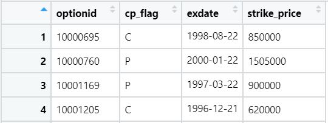
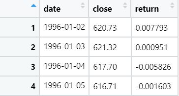
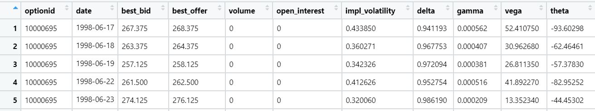
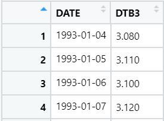
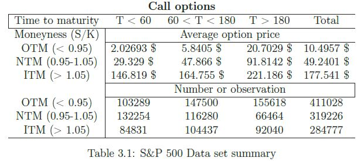
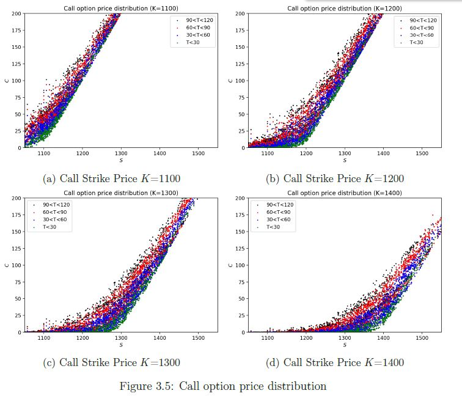
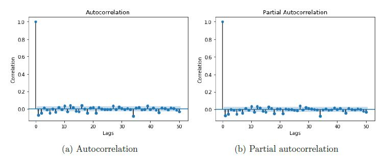
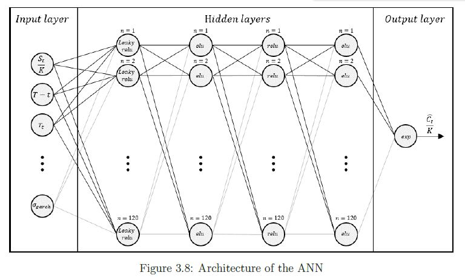
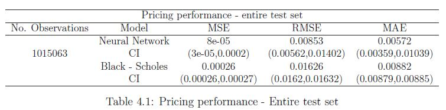
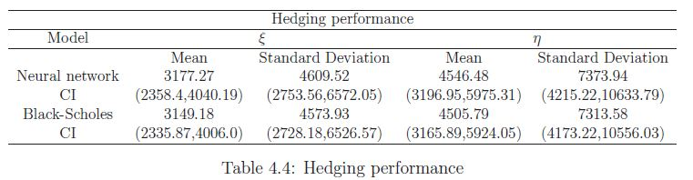

## About The Project
This repository contains the code I used to implement my [Master Thesis](https://drive.google.com/file/d/10HyWkxlwQhEKOBWlki_VtLC-yPQkAnAL/view?usp=sharing) in which I compare the Black and Scholes pricing formula against an Artificial Neural Networks model for option pricing and delta hedging strategy.

## Data
The datasets used in this project are:
* **Option_characteristics.csv**. Which contains the options' flag, the expiration date and the strike price.

    
  </a>

* **Index_series.csv**. Which contains the time series data of the S&P 500 index, so the date the closing price and the return.

    
  </a>

* **Option_series.csv**. Which contains the time series data for each individual option with bid/ask prices, volume, greeks, implied vol etc.

    
  </a>

* **Treasury_bill.csv**. Which contains the time series data for the 90-day US treasury bill.

    
  </a>

## Usage
All the necessary steps in order to run this project are described in this section. 

**1_Preparing_data_frames.md** in this R file the databases containing the option's information are merged together in one big file, the columns containing data not useful for the project are dropped and the remaining columns are renamed. After running this file, 3 new databases will be created:
* option_file. Which contains all the useful information about the option time series.
* index_series. Which differ form the original file only in the name of the variables
* treasury_bill. Which contains the time series data for the 90-day US treasury bill in percentage.

**2_Compute_B&S_and_GARCH.py** this python script is needed to:
* Estimate the GARCH volatility on the returns
* Compute the Black and Scholes pricing formula using different volatility windows and the GARCH volatility.
After the computation the dataset **rawdata.csv** is created. This contain all the information about the options, the black and scholes predicted prices, GARCH volatility estimation and the different historical volatilities.

**3_Split_Put_and_Call_data** in this R markdown the dataset created in the previous step (**rawdata.csv**) is loaded. Afterwards the no further needed variables are removed and the cleaning process start:
* The dataset is divided in Call and Put. The process of removing the non representative observations differ slightely between Put and Call. After the cleaning process, 3 new datasets are exported:
  * **pdata.csv** which contains observations of both Put and Call options. These data will be used afterwards for visualization purposes.
  * **call.csv** which contains only information regarding the Call options. This is the final file used to implement all the analysis.
  * **put.csv** which contains only information regarding the Put options. This file is not used in this project, however the same analysis can be run also with this file in order to study the Put option instead of the Call.

**4_Compute_Call_summary_table** running this script compute the table which describes the moneyness distributed regarding the maturity time of the Call option.

    
  </a>

**5_Compute_data_summary** this scripts plots all the descriptive graphs of the data. 

    
  </a>

**6_Compute_volatility_summary** this script is used to plot all the GARCH volatility performances.

    
  </a>

**7_Train_ANN** with this script the Neural Network is implemented and trained
 

    
  </a>

**8_Evaluate_ANN** running this file the comparison ANN and BSM regarding pricing prediction is obtained and the descriptive graphs are plotted

**9_Comput_pricing_results_table** this file groups in a table the pricing results obtained in the previous step. Furthermore, they are grouped in different groups based on moneyness, maturity and volatility
 

    
  </a>

**10_Compute_Hedging** in this script the hedging strategy is implemented

**11_Hedging_results** in this script the comparison between the hedging strategy performed with the ANN model and the BSM model is printed in a table 

 

    
  </a>

